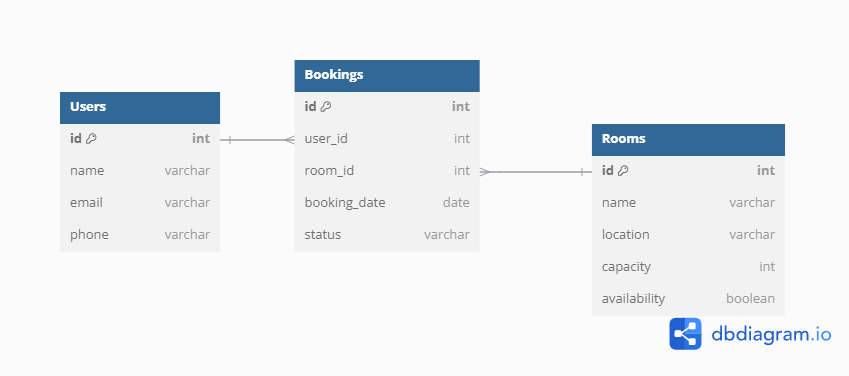

# MyBook

## Welcome to the MyBook App

image here

live link here:

exposition about features

## Index

- UX/User Stories
- Features
- Design
- Testing
- Deployment
- Technologies Used
- Credits

## UX / User Stories

### <i>Must Haves:</i>

<b>Account Creation:</b>

As a User I can make an account so that I can create bookings and view bookings I have made in the past.

Acceptance Criteria:

- Be able to make an account (username + password)
- Be able to view previous bookings

<b>Admin Management:</b>

As an Admin I can access a dashboard so that I can manage booking and users.

Acceptance Criteria:

- Accessing dashboard as superuser
- Manage bookings
- Manage users

<b>Service Listing:</b>

As a user, I must be able to view a list of services available for booking so that I can choose the one I need.

Acceptance Criteria:

- Be able to a view a list of services
- Be able to choose a service

<b>Booking Management for the User:</b>

As a user, I must be able to view my current bookings and cancel them if needed.

Acceptance Criteria:

- Be able to view current bookings
- Be able to cancel current bookings

<b>Booking Management for the Admin:</b>

As an admin , I must be able to view my current bookings and cancel them if needed.

Acceptance Criteria:

- Be able to view current bookings
- Be able to cancel current bookings

<b>Booking Creation:</b>

As a user, I must be able to select a service, choose a date and time, and confirm my booking so that my reservation is secured.

Acceptance Criteria:

- Be able to select a service
- Be able to choose a date and time
- Be able to confirm a booking

### <i>Should Haves:</i>

<b>Notifications for the User:</b>

As a user, I should receive email notifications to confirm my booking and remind me of upcoming appointments.

Acceptance Criteria:

- Be able to receive email notifications to confirm bookings
- Be able to receive reminders for upcoming bookings

<b>Notifications for the Admin:</b>

As an admin, I should receive notifications about new bookings or cancellations.

Acceptance Criteria:

- Be able to receive notifications about new bookings
- Be able to receive notifications about new cancellations

<b>Search & Filters:</b>

As a user, I should be able to search for services and filter them by category, availability, or price.

Acceptance Criteria:

- Be able to search for services
- Be able to filter by category, availability and price

<b>Calendar for the User:</b>

As a user, I should be able to view my bookings on a calendar for better organization.

Acceptance Criteria:

- Be able to view bookings on the calendar

<b>Calendar for the Admin:</b>

As an admin, I should see a calendar of all bookings to manage conflicts.

Acceptance Criteria:

- Be able to see a calendar including all user bookings

### <i>Could Haves:</i>

<b>User Reviews & Ratings:</b>

As a user, I could leave reviews and ratings for the services I book to share feedback.

Acceptance Criteria:

- Be able to reviews and ratings
- Be able to share feedback on services

<b>Mobile App Integration:</b>

As a user, I could use a mobile app for a more convenient booking experience.

Acceptance Criteria:

- Be able to use the app on mobile devices

### <i>Won't Haves:</i>

<b>Third Party Integrations:</b>

As a user, I won’t have integrations with third-party calendars (e.g., Google Calendar) in the initial version but might have it in the future.

Acceptance Criteria:

- Integrate a third party calendar

## Planning

### Wireframes
Home Page:

Mobile Page:

### Agile Development
Kanban Board:

### Entity Relationship Diagram

## Features

# Background Image

The background images showcases a couple using a laptop to make a booking. This is to enhance the user's experience and this is likely to make the user think that there is a positive reaction to using my site. 

# Services Section

The services section showcases available bookings and allows the user to filter these bookings by location, minimum and maximum price. These bookings were paginated by 6 to show a good amount of content on all screen sizes. 

# Navbar

The Navbar allows the user to see all the links to the information with descriptive titles so that the user knows where the link will take them. These were made as simple as possible while also allowing the user to know what information they will gain by using the link.

# Profiles

There is a few profile pages. Firstly, using the navbar link Login. You are able to login to an account and new users are able to register if they do not have an account. These can also be accessed by an unauthorised user if they use the click on the profile image in the center of the navbar. When the user is logged in and they are authorised then their own bookings can be accessed using the profile image. The user is shown information on their current booking and they are able to cancel or update them. When the user would like to logout then they are able to do so by using the logout navbar link that shows when the user is authenticated. 
# Profile Login:

# Login Page

# Registration Page:

# Authenticated Navbar

# Profile Page:

# About Us

The about us page showcases what the site does and uses the same template as the homepage with different text.

# Booking

When you click on the book now button on the services card, it takes you to this page where you can choose your clock-in and clock-out dates, add guests and then the total price is calculated for you in the profile page.

## Testing

# HTML Validation

# CSS Validation

# Accessability and Performance Validation

# Pep8 Validation

# Known Bugs

## Deployment

## Technologies Used

## Credits